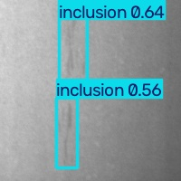
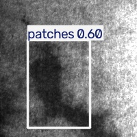

# Real-Time Industrial Defect Detection System

Internship Project-1 with Zaalima Development

## Video Processing Module

**Owner:** D. Chinmayi  
**Scope:** OpenCV + Video Processing

### Implemented Features

- [x] Video capture loop (webcam / file / stream input)
- [x] FPS benchmarking
- [x] YOLOv8 model integration for real-time inference
- [x] Single-image detection script
- [x] Interactive web app for multi-image upload and detection
- [x] Verified on sample defect images and test video

## Usage

### Live video / webcam detection
```bash
# Webcam
python capture.py --source 0 --model best.pt

# Video file
python capture.py --source test_video.mp4 --model best.pt

# Headless mode (no display window), stop after 200 frames
python capture.py --source test_video.mp4 --model best.pt --no-display --max-frames 200
```

### Single image detection
```bash
python detect_image.py --image sample_1.jpg --model best.pt
```
Saves an annotated output image and prints a summary of detected defects
(class name + confidence score) to the console.

### Interactive Web App

A browser-based interface for uploading one or more images and viewing
annotated detection results with bounding boxes and confidence scores.

```bash
python app.py
```
Then open `http://localhost:8001` in your browser.

## Results

Sample detections from the trained YOLOv8 model, run through this module's
inference pipeline. Full-resolution outputs are in the `/results` folder.

| Input | Detection Result |
|---|---|
| `sample_1.jpg` |  |
| `sample_2.jpg` |  |

The pipeline was also verified on a test video feed, successfully
detecting and annotating defects frame-by-frame while tracking real-time FPS.

## Dependencies
- opencv-python
- ultralytics
- fastapi
- uvicorn
- python-multipart
- pillow